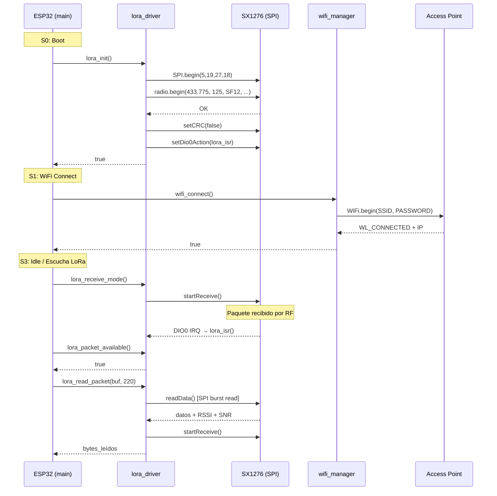
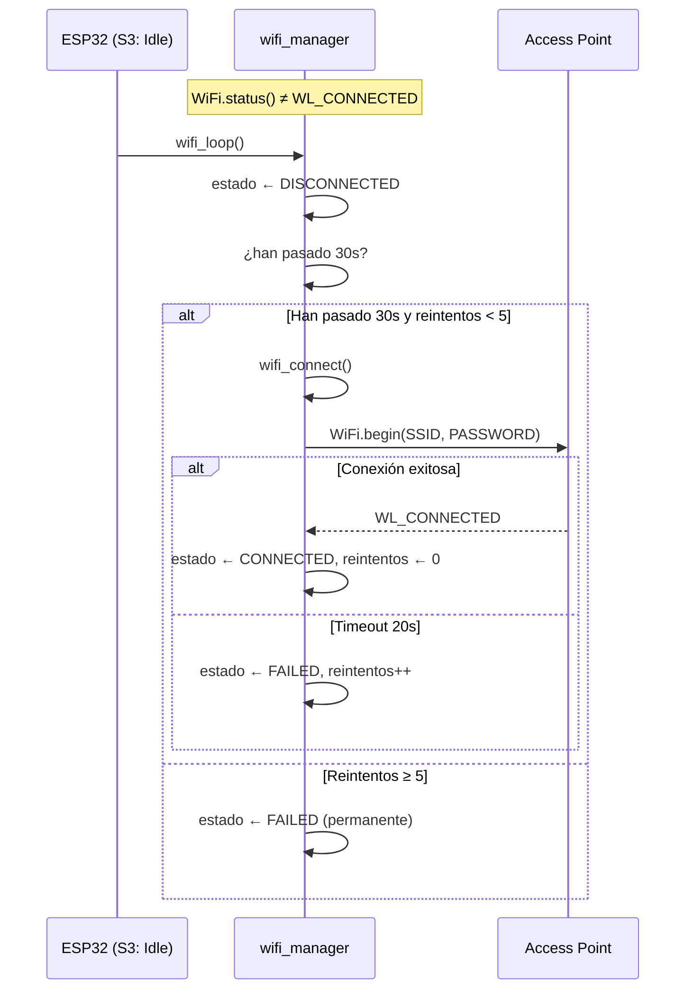
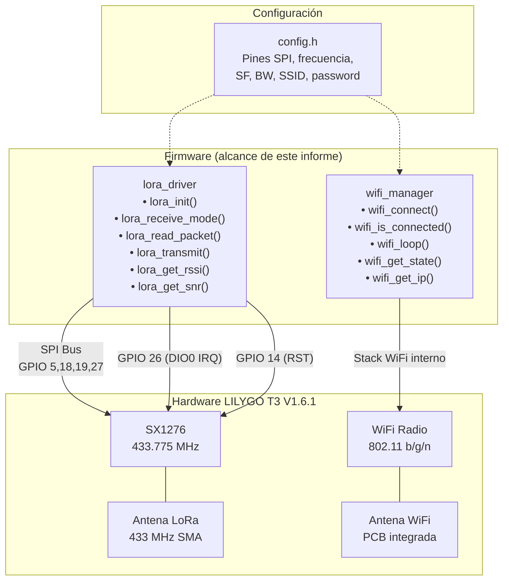
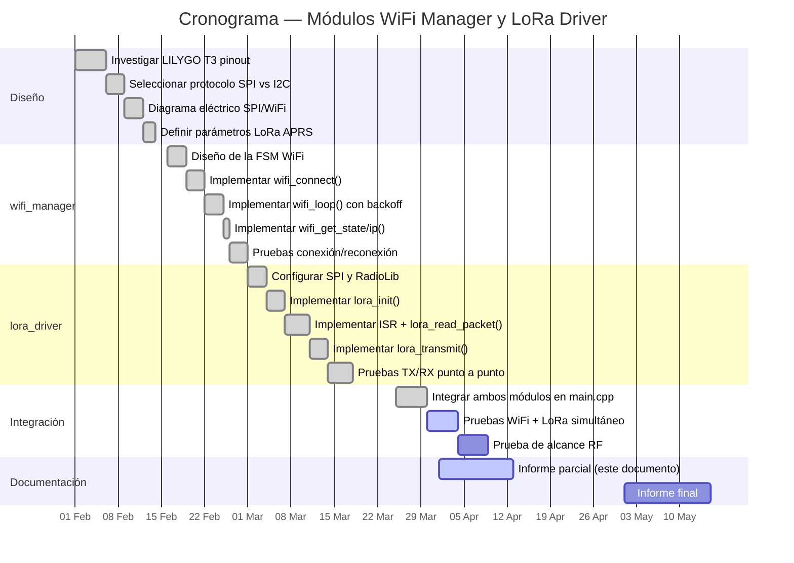

# Informe Parcial — Módulos WiFi Manager y LoRa Driver

**Proyecto:** iGate APRS LoRa (TI1TEC-10)  
**Plataforma:** LILYGO T3 V1.6.1 (ESP32 + SX1276)  
**Firmware:** v1.0.0 | PlatformIO + Arduino Framework  
**Fecha:** Abril 2026  
**Alcance:** Este informe cubre exclusivamente los módulos `wifi_manager` y `lora_driver`.

---

## 1. Diagrama Eléctrico de Conexiones

El diagrama muestra únicamente las interfaces relevantes a los dos módulos presentados: el bus SPI hacia el transceptor LoRa SX1276 y la radio WiFi integrada del ESP32.

```
                              ┌──────────────────────────┐
                              │        ESP32              │
                              │    (LILYGO T3 V1.6.1)    │
                              │                           │
  ┌───── Bus SPI (VSPI) ─────┤ GPIO 5   ── SCK           │
  │                           │ GPIO 19  ── MISO          │
  │                           │ GPIO 27  ── MOSI          │
  │                           │ GPIO 18  ── CS (SS)       │
  │                           │                           │
  │     Control digital ──────┤ GPIO 14  ── RST           │
  │                           │ GPIO 26  ── DIO0 (IRQ RX) │
  │                           │ GPIO 33  ── DIO1          │
  │                           │                           │
  │          WiFi interno ────┤ 802.11 b/g/n              │
  │                           │ Antena PCB integrada      │
  │                           └──────────────────────────-┘
  │
  │        ┌──────────────────────┐
  │        │     SX1276 (LoRa)    │
  └────────┤ SCK  MISO  MOSI  CS │
           │ RST ← GPIO 14       │
           │ DIO0 → GPIO 26 (IRQ)│
           │ DIO1 → GPIO 33      │
           │                      │
           │   433.775 MHz        │
           └──────────┬───────────┘
                      │
               ┌──────┴──────┐
               │ Antena SMA  │
               │  433 MHz    │
               └─────────────┘


  ┌──────────────────────────────────────────────────┐
  │           Diagrama de buses simplificado          │
  │                                                    │
  │  ESP32 ──[SPI: 4 hilos]──► SX1276 LoRa            │
  │    │                          │                    │
  │    │      GPIO 26 (DIO0)      │                    │
  │    │◄──── IRQ (paquete RX) ───┘                    │
  │    │                                               │
  │    └──[WiFi 802.11 interno]──► Access Point        │
  │                                   │                │
  │                              Internet (TCP/IP)     │
  └──────────────────────────────────────────────────┘
```

### Tabla de Pines — WiFi Manager y LoRa Driver

| Periférico   | Señal   | GPIO ESP32 | Protocolo | Módulo Firmware  |
|-------------|---------|-----------|-----------|------------------|
| SX1276 LoRa | SCK     | GPIO 5    | SPI       | `lora_driver`    |
| SX1276 LoRa | MISO    | GPIO 19   | SPI       | `lora_driver`    |
| SX1276 LoRa | MOSI    | GPIO 27   | SPI       | `lora_driver`    |
| SX1276 LoRa | CS (SS) | GPIO 18   | SPI       | `lora_driver`    |
| SX1276 LoRa | RST     | GPIO 14   | Digital   | `lora_driver`    |
| SX1276 LoRa | DIO0    | GPIO 26   | IRQ (ISR) | `lora_driver`    |
| SX1276 LoRa | DIO1    | GPIO 33   | Digital   | `lora_driver`    |
| WiFi        | —       | Interno   | 802.11    | `wifi_manager`   |

---

## 2. Justificación de Protocolos

### 2.1 SPI — Comunicación ESP32 ↔ SX1276 (`lora_driver`)

**¿Por qué SPI y no otro protocolo?**

| Criterio                | Justificación                                                                 |
|------------------------|-------------------------------------------------------------------------------|
| **Únca interfaz del chip** | El SX1276 de Semtech solo expone interfaz SPI; no tiene I2C ni UART        |
| **Velocidad**          | SPI opera hasta 10 MHz en el SX1276; necesario para leer el FIFO de 256 bytes con baja latencia |
| **Full-duplex**        | Lectura simultánea de registros mientras se escriben comandos de control      |
| **Latencia crítica**   | Tras la interrupción DIO0, se debe leer el paquete del FIFO inmediatamente para no perderlo |
| **RadioLib**           | La librería RadioLib utiliza SPI como transporte nativo; no soporta otra interfaz para SX127x |

**Señales SPI utilizadas:**

| Señal | GPIO | Dirección        | Función                                      |
|-------|------|-----------------|----------------------------------------------|
| SCK   | 5    | ESP32 → SX1276  | Reloj síncrono generado por el maestro       |
| MOSI  | 27   | ESP32 → SX1276  | Datos del maestro al esclavo (comandos/writes)|
| MISO  | 19   | SX1276 → ESP32  | Datos del esclavo al maestro (lecturas FIFO) |
| CS    | 18   | ESP32 → SX1276  | Chip Select — activo bajo, selecciona SX1276 |

**Señales de control adicionales:**

| Señal | GPIO | Función                                                            |
|-------|------|--------------------------------------------------------------------|
| RST   | 14   | Reset hardware del SX1276 — controlado por RadioLib en `begin()`  |
| DIO0  | 26   | Interrupción de recepción — dispara la ISR `lora_isr()` en RISING |
| DIO1  | 33   | Señal auxiliar — disponible para timeout o CAD                     |

**Inicialización en el código** ([lora_driver.cpp](../Firmware/src/lora_driver.cpp#L30)):
```cpp
SPI.begin(LORA_SCK, LORA_MISO, LORA_MOSI, LORA_CS);  // GPIO 5, 19, 27, 18

int16_t state = radio.begin(
    LORA_FREQ / 1e6,   // 433.775 MHz
    LORA_BW  / 1e3,    // 125 kHz
    LORA_SF,            // SF12
    LORA_CR,            // CR 4/5
    LORA_SYNC,          // 0x12
    LORA_POWER,         // 17 dBm
    LORA_PREAMBLE       // 8 símbolos
);
```

### 2.2 WiFi 802.11 b/g/n — Conectividad TCP/IP (`wifi_manager`)

**¿Por qué WiFi y no Ethernet/Bluetooth/celular?**

| Criterio               | Justificación                                                                 |
|------------------------|-------------------------------------------------------------------------------|
| **Integrado en ESP32** | No requiere hardware externo ni pines adicionales; antena PCB incluida       |
| **TCP/IP nativo**      | El iGate necesita socket TCP al puerto 14580 de APRS-IS; WiFi provee stack IP completo |
| **Alcance suficiente** | El iGate es estacionario; alcance doméstico de un AP basta                   |
| **Costo cero**         | No consume GPIOs ni componentes adicionales                                   |
| **Bajo consumo**       | Modo STA sin AP propio; `WiFi.setAutoReconnect(false)` permite control manual |

**Protocolo de operación en el firmware:**

| Aspecto               | Implementación                                                              |
|------------------------|-----------------------------------------------------------------------------|
| **Modo**              | `WIFI_STA` — modo estación (cliente), no levanta AP propio                  |
| **Timeout conexión**  | 20 s (`WIFI_TIMEOUT_MS`) — bloqueante en `wifi_connect()`                   |
| **Reconexión auto.**  | Deshabilitada (`setAutoReconnect(false)`) — controlada manualmente por la FSM |
| **Backoff reintentos** | 30 s entre intentos, máximo 5 reintentos antes de fallo permanente         |
| **Watchdog**          | `esp_task_wdt_reset()` durante espera para evitar reset del sistema          |

**Máquina de estados WiFi** (enum `WifiState`):

```
DISCONNECTED ──► CONNECTING ──► CONNECTED
       ▲              │
       │              ▼
       └────────── FAILED (tras 5 reintentos)
```

**Código del flujo de conexión** ([wifi_manager.cpp](../Firmware/src/wifi_manager.cpp#L19)):
```cpp
WiFi.mode(WIFI_STA);
WiFi.setAutoReconnect(false);
WiFi.begin(WIFI_SSID, WIFI_PASSWORD);

// Espera con timeout de 20s
while (WiFi.status() != WL_CONNECTED) {
    if (millis() - start >= WIFI_TIMEOUT_MS) {
        _state = WifiState::FAILED;
        return false;
    }
    esp_task_wdt_reset();  // no disparar watchdog
    delay(500);
}
```

### 2.3 LoRa — Enlace de Radio Largo Alcance

| Parámetro       | Valor         | Justificación                                                  |
|-----------------|---------------|----------------------------------------------------------------|
| Frecuencia      | 433.775 MHz   | Banda ISM asignada para APRS LoRa en la Región 2 (Américas)   |
| Spreading Factor| SF12          | Máxima sensibilidad (-137 dBm); prioriza alcance sobre velocidad|
| Ancho de banda  | 125 kHz       | Estándar LoRa APRS; buena relación alcance/throughput          |
| Coding Rate     | 4/5 (CR=5)    | Mínima redundancia FEC; suficiente para canal limpio           |
| Potencia TX     | 17 dBm        | Máximo permitido por el SX1276 sin amplificador externo        |
| Sync Word       | 0x12          | Sync word oficial de LoRa APRS (diferencia de LoRaWAN 0x34)   |
| Preámbulo       | 8 símbolos    | Estándar para detección de paquetes LoRa APRS                  |
| CRC             | Deshabilitado | Requerido por el estándar LoRa APRS (`radio.setCRC(false)`)   |

---

## 3. Pseudocódigo de los Módulos

### 3.1 Pseudocódigo — `wifi_manager`

```
MÓDULO wifi_manager

VARIABLES INTERNAS:
    estado         : WifiState = DISCONNECTED
    último_intento : timestamp = 0
    reintentos     : entero = 0
    MAX_REINTENTOS : 5
    INTERVALO_REINTENTO : 30 s

────────────────────────────────────────────

FUNCIÓN wifi_connect() → booleano
    Imprimir "[WiFi] Conectando a SSID..."
    estado ← CONNECTING

    Configurar modo estación (STA)
    Deshabilitar reconexión automática
    Iniciar conexión con SSID y PASSWORD

    inicio ← tiempo_actual()
    MIENTRAS WiFi no conectado:
        SI tiempo_actual() - inicio ≥ 20 s:
            estado ← FAILED
            reintentos++
            RETORNAR falso
        FIN SI
        Alimentar watchdog
        Esperar 500 ms
    FIN MIENTRAS

    estado ← CONNECTED
    reintentos ← 0
    Imprimir IP asignada
    RETORNAR verdadero
FIN FUNCIÓN

────────────────────────────────────────────

FUNCIÓN wifi_is_connected() → booleano
    RETORNAR WiFi.status() == WL_CONNECTED
FIN FUNCIÓN

────────────────────────────────────────────

FUNCIÓN wifi_loop()
    // Llamar desde el loop principal en cada ciclo

    SI WiFi conectado:
        estado ← CONNECTED
        RETORNAR  // nada que hacer
    FIN SI

    estado ← DISCONNECTED

    // Backoff: esperar intervalo entre reintentos
    SI tiempo_actual() - último_intento < 30 s:
        RETORNAR
    FIN SI
    último_intento ← tiempo_actual()

    SI reintentos ≥ MAX_REINTENTOS:
        Imprimir "Máximo de reintentos alcanzado"
        estado ← FAILED
        RETORNAR
    FIN SI

    Imprimir "Reintentando conexión (N/5)..."
    wifi_connect()
FIN FUNCIÓN

────────────────────────────────────────────

FUNCIÓN wifi_get_state() → WifiState
    RETORNAR estado
FIN FUNCIÓN

FUNCIÓN wifi_get_ip() → String
    SI no conectado: RETORNAR "0.0.0.0"
    RETORNAR dirección IP local
FIN FUNCIÓN
```

### 3.2 Pseudocódigo — `lora_driver`

```
MÓDULO lora_driver

VARIABLES INTERNAS:
    radio          : SX1276(CS=18, DIO0=26, RST=14, DIO1=33)
    flag_paquete   : booleano volátil = falso
    buffer_rx[256] : arreglo de bytes
    longitud_rx    : entero = 0
    último_rssi    : entero = 0
    último_snr     : flotante = 0.0

────────────────────────────────────────────

ISR lora_isr()     // Se ejecuta en contexto de interrupción
    flag_paquete ← verdadero
FIN ISR

────────────────────────────────────────────

FUNCIÓN lora_init() → booleano
    // Paso 1: Configurar bus SPI con pines del LILYGO T3
    SPI.begin(SCK=5, MISO=19, MOSI=27, CS=18)

    // Paso 2: Inicializar radio con parámetros LoRa APRS
    resultado ← radio.begin(
        frecuencia  = 433.775 MHz,
        ancho_banda = 125 kHz,
        spreading   = SF12,
        coding_rate = 4/5,
        sync_word   = 0x12,
        potencia    = 17 dBm,
        preámbulo   = 8 símbolos
    )

    SI resultado ≠ OK:
        Imprimir error
        RETORNAR falso
    FIN SI

    // Paso 3: Desactivar CRC (requerido por LoRa APRS)
    radio.setCRC(falso)

    // Paso 4: Asociar ISR a DIO0 (flanco ascendente)
    radio.setDio0Action(lora_isr, RISING)

    RETORNAR verdadero
FIN FUNCIÓN

────────────────────────────────────────────

FUNCIÓN lora_receive_mode()
    flag_paquete ← falso
    radio.startReceive()    // modo recepción continua
FIN FUNCIÓN

────────────────────────────────────────────

FUNCIÓN lora_packet_available() → booleano
    RETORNAR flag_paquete
FIN FUNCIÓN

────────────────────────────────────────────

FUNCIÓN lora_read_packet(buffer, max_len) → bytes_leídos
    SI flag_paquete es falso: RETORNAR 0
    flag_paquete ← falso

    // Leer datos del FIFO del SX1276 vía SPI
    resultado ← radio.readData(buffer_rx, 256)

    SI resultado ≠ OK:
        Imprimir error
        lora_receive_mode()    // volver a escuchar
        RETORNAR 0
    FIN SI

    // Guardar métricas del paquete
    último_rssi ← radio.getRSSI()
    último_snr  ← radio.getSNR()
    longitud_rx ← radio.getPacketLength()

    // Copiar al buffer del llamador
    copiar min(longitud_rx, max_len) bytes a buffer

    Imprimir "Paquete N bytes | RSSI: X dBm | SNR: Y dB"

    // Volver inmediatamente a modo recepción
    lora_receive_mode()
    RETORNAR bytes copiados
FIN FUNCIÓN

────────────────────────────────────────────

FUNCIÓN lora_transmit(buffer, longitud) → booleano
    Imprimir "Transmitiendo N bytes..."

    // Detener recepción, pasar a standby
    radio.standby()

    // Enviar datos por SPI al FIFO del SX1276
    resultado ← radio.transmit(buffer, longitud)

    SI resultado ≠ OK:
        Imprimir error
        lora_receive_mode()
        RETORNAR falso
    FIN SI

    Imprimir "TX OK"
    lora_receive_mode()    // volver a escuchar
    RETORNAR verdadero
FIN FUNCIÓN

────────────────────────────────────────────

FUNCIÓN lora_get_rssi() → entero
    RETORNAR último_rssi
FIN FUNCIÓN

FUNCIÓN lora_get_snr() → flotante
    RETORNAR último_snr
FIN FUNCIÓN
```

---

## 4. Tramas de Datos

### 4.1 Trama LoRa en el aire (capa física gestionada por `lora_driver`)

```
┌───────────┬────────┬───────────────────────┬──────────────────────────────┐
│ Preámbulo │ Sync   │      Header LoRa      │          Payload             │
│ 8 símb.   │ 0x12   │ (implícito SF12/BW125)│  Hasta 256 bytes de datos    │
└───────────┴────────┴───────────────────────┴──────────────────────────────┘
     ↑           ↑                                       ↑
     │           │                                       │
  Detecta el  Diferencia LoRa APRS         Contenido pasado a
  receptor    (0x12) de LoRaWAN (0x34)     lora_read_packet()
```

**Parámetros de modulación configurados en `lora_init()`:**

| Parámetro        | Valor    | Efecto en la trama                             |
|-----------------|----------|-------------------------------------------------|
| SF12            | 12       | 4096 chips/símbolo → máxima sensibilidad        |
| BW 125 kHz     | 125000   | Tiempo de símbolo = 32.77 ms                    |
| CR 4/5          | 5        | 1 bit de FEC cada 4 bits útiles                 |
| Preámbulo 8     | 8        | ~262 ms de preámbulo a SF12/BW125               |
| CRC off         | false    | Sin CRC de capa LoRa (estándar APRS)            |

**Tasa de datos efectiva:** ~293 bps (SF12, BW125, CR4/5)

### 4.2 Flujo SPI entre ESP32 y SX1276

**Secuencia de recepción (`lora_read_packet`):**
```
DIO0 ──RISING──► ISR lora_isr() → flag = true
                      │
                      ▼
    ┌─────────────────────────────────────────┐
    │ 1. CS LOW                               │
    │ 2. MOSI: RegFifoAddrPtr (read)          │
    │    MISO: dirección FIFO                 │
    │ 3. MOSI: RegFifo (burst read)           │
    │    MISO: byte[0] byte[1] ... byte[N-1]  │
    │ 4. CS HIGH                              │
    │ 5. Leer RSSI (RegPktRssiValue)          │
    │ 6. Leer SNR  (RegPktSnrValue)           │
    └─────────────────────────────────────────┘
```

**Secuencia de transmisión (`lora_transmit`):**
```
    ┌─────────────────────────────────────────┐
    │ 1. radio.standby() — detener RX         │
    │ 2. CS LOW                               │
    │ 3. MOSI: RegFifoAddrPtr (write base)    │
    │ 4. MOSI: RegFifo (burst write)          │
    │    → byte[0] byte[1] ... byte[N-1]      │
    │ 5. CS HIGH                              │
    │ 6. RegOpMode ← TX                       │
    │ 7. Esperar TxDone (DIO0 IRQ)            │
    │ 8. radio.startReceive() — volver a RX   │
    └─────────────────────────────────────────┘
```

### 4.3 Flujo de datos WiFi (`wifi_manager`)

**Secuencia de conexión:**
```
    ┌─────────────────────────────────────────┐
    │ ESP32 (STA)           Access Point      │
    │                                          │
    │ ──── Probe Request ──────────►           │
    │ ◄─── Probe Response ─────────           │
    │ ──── Auth Request ───────────►           │
    │ ◄─── Auth Response ──────────           │
    │ ──── Association Request ────►           │
    │ ◄─── Association Response ───           │
    │ ──── DHCP Discover ──────────►           │
    │ ◄─── DHCP Offer ─────────────           │
    │ ──── DHCP Request ───────────►           │
    │ ◄─── DHCP ACK (IP asignada) ─           │
    │                                          │
    │      WiFi.status() == WL_CONNECTED       │
    └─────────────────────────────────────────┘
```

**Reconexión con backoff (`wifi_loop`):**
```
Caída detectada
   │
   ├── t=0s:    intento 1 → wifi_connect()
   ├── t=30s:   intento 2 → wifi_connect()
   ├── t=60s:   intento 3 → wifi_connect()
   ├── t=90s:   intento 4 → wifi_connect()
   ├── t=120s:  intento 5 → wifi_connect()
   └── t=150s:  estado ← FAILED (no más reintentos)
```

---

## 5. Diagramas de Interacción

### 5.1 Diagrama de secuencia — Inicialización y recepción



### 5.2 Diagrama de secuencia — Reconexión WiFi



### 5.3 Diagrama de arquitectura de módulos



---

## 6. Cronograma del Proyecto



---

## 7. Presupuesto

### 7.1 Hardware (relevante a wifi_manager y lora_driver)

| Componente                             | Cantidad | Precio Unitario (USD) | Subtotal (USD) |
|---------------------------------------|----------|----------------------|-----------------|
| LILYGO T3 V1.6.1 (ESP32 + SX1276)    | 1        | $22.00               | $22.00          |
| Antena 433 MHz SMA (5 dBi)            | 1        | $5.00                | $5.00           |
| Cable USB-C (programación + alimentación) | 1    | $3.00                | $3.00           |
| Fuente 5V 1A USB                      | 1        | $4.00                | $4.00           |
| **Subtotal Hardware**                  |          |                      | **$34.00**      |

### 7.2 Nodo Remoto (para pruebas LoRa punto a punto)

| Componente                        | Cantidad | Precio Unitario (USD) | Subtotal (USD) |
|----------------------------------|----------|----------------------|-----------------|
| LILYGO T3 V1.6.1 (nodo pruebas) | 1        | $22.00               | $22.00          |
| Antena 433 MHz SMA               | 1        | $5.00                | $5.00           |
| **Subtotal Nodo**                |          |                      | **$27.00**      |

### 7.3 Software y Servicios

| Recurso                          | Costo    | Uso en el proyecto                    |
|----------------------------------|----------|---------------------------------------|
| PlatformIO + Arduino Framework   | Gratis   | Compilación y carga del firmware      |
| RadioLib v6.6.0 (MIT)           | Gratis   | Driver SX1276 para `lora_driver`      |
| WiFi library (esp32 core)       | Gratis   | Stack WiFi para `wifi_manager`        |
| SPI library (esp32 core)        | Gratis   | Bus SPI para `lora_driver`            |

### 7.4 Resumen

| Categoría          | Total (USD) |
|--------------------|-------------|
| Hardware iGate     | $34.00      |
| Nodo de pruebas    | $27.00      |
| Software           | $0.00       |
| **TOTAL**          | **$61.00**  |

---

## 8. Parámetros de Configuración Relevantes

Definidos en [config.h](../Firmware/src/config.h):

### WiFi (`wifi_manager`)

| Parámetro           | Valor               | Descripción                         |
|---------------------|---------------------|-------------------------------------|
| `WIFI_SSID`         | (definido en config)| Nombre de la red WiFi               |
| `WIFI_PASSWORD`     | (definido en config)| Contraseña de la red WiFi           |
| `WIFI_TIMEOUT_MS`   | 20000 (20 s)        | Timeout de espera de conexión       |

### LoRa SX1276 (`lora_driver`)

| Parámetro           | Valor              | Descripción                         |
|---------------------|--------------------|-------------------------------------|
| `LORA_FREQ`         | 433.775 MHz        | Frecuencia APRS LoRa Región 2      |
| `LORA_BW`           | 125 kHz            | Ancho de banda                      |
| `LORA_SF`           | 12                 | Spreading Factor                    |
| `LORA_CR`           | 5                  | Coding Rate (4/5)                   |
| `LORA_SYNC`         | 0x12               | Sync Word LoRa APRS                |
| `LORA_POWER`        | 17 dBm             | Potencia TX (~50 mW)               |
| `LORA_PREAMBLE`     | 8                  | Longitud del preámbulo (símbolos)   |
| `LORA_SCK`          | GPIO 5             | SPI Clock                          |
| `LORA_MISO`         | GPIO 19            | SPI Master-In Slave-Out            |
| `LORA_MOSI`         | GPIO 27            | SPI Master-Out Slave-In            |
| `LORA_CS`           | GPIO 18            | SPI Chip Select                    |
| `LORA_RST`          | GPIO 14            | Reset del SX1276                   |
| `LORA_DIO0`         | GPIO 26            | Interrupción RX                    |
| `LORA_DIO1`         | GPIO 33            | Señal auxiliar                     |

---

## 9. API Pública de los Módulos

### `wifi_manager.h`

| Función              | Retorno     | Descripción                                      |
|---------------------|-------------|--------------------------------------------------|
| `wifi_connect()`    | `bool`      | Conecta al AP; bloquea hasta 20s                 |
| `wifi_is_connected()` | `bool`   | Consulta estado real del driver WiFi              |
| `wifi_loop()`       | `void`      | Reconexión automática con backoff (llamar en loop)|
| `wifi_get_state()`  | `WifiState` | Estado interno: DISCONNECTED/CONNECTING/CONNECTED/FAILED |
| `wifi_get_ip()`     | `String`    | IP asignada o "0.0.0.0"                          |

### `lora_driver.h`

| Función                              | Retorno   | Descripción                                    |
|--------------------------------------|-----------|------------------------------------------------|
| `lora_init()`                        | `bool`    | Configura SPI + SX1276; retorna false si falla |
| `lora_receive_mode()`               | `void`    | Entra en recepción continua                     |
| `lora_packet_available()`           | `bool`    | True si DIO0 disparó la ISR                     |
| `lora_read_packet(buf, max_len)`    | `uint8_t` | Lee paquete del FIFO; retorna bytes leídos      |
| `lora_transmit(buf, len)`           | `bool`    | Transmite buffer; bloquea hasta fin de TX       |
| `lora_get_rssi()`                   | `int16_t` | RSSI del último paquete (dBm)                   |
| `lora_get_snr()`                    | `float`   | SNR del último paquete (dB)                     |