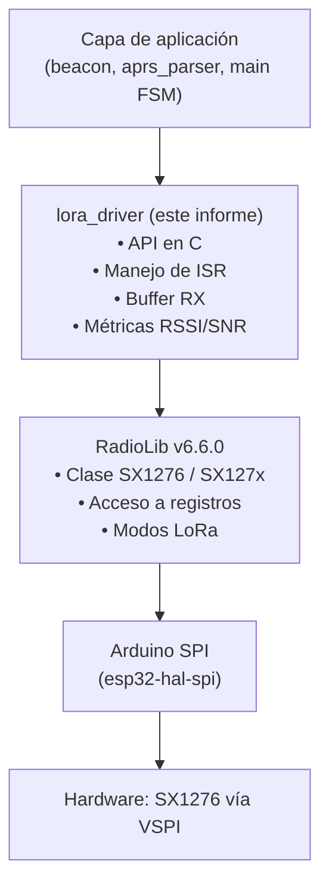
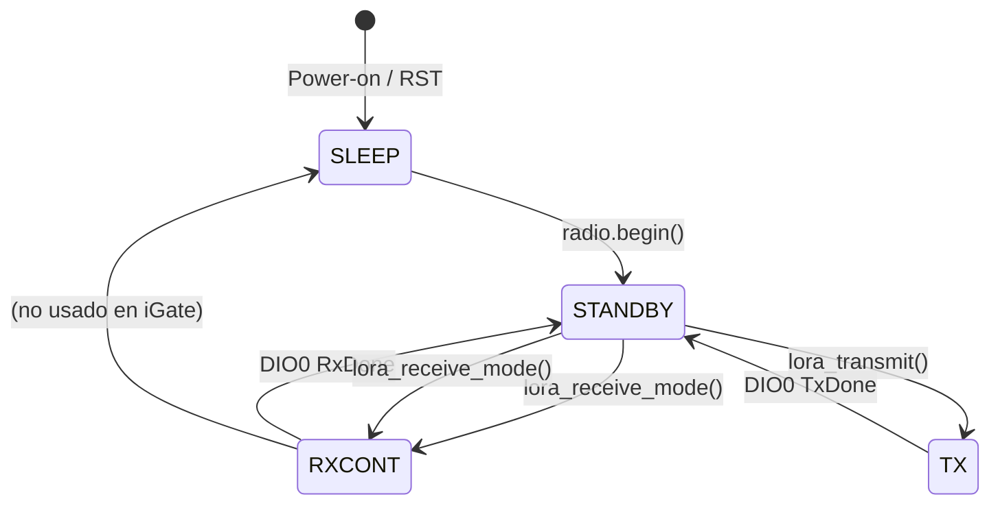
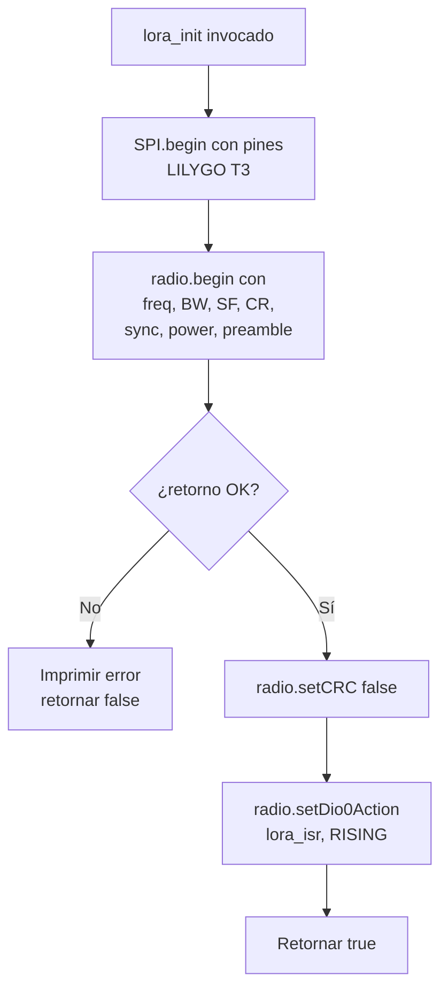
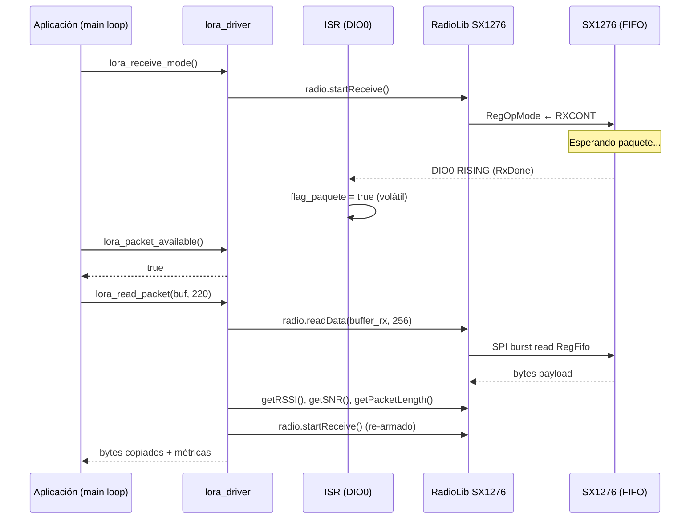
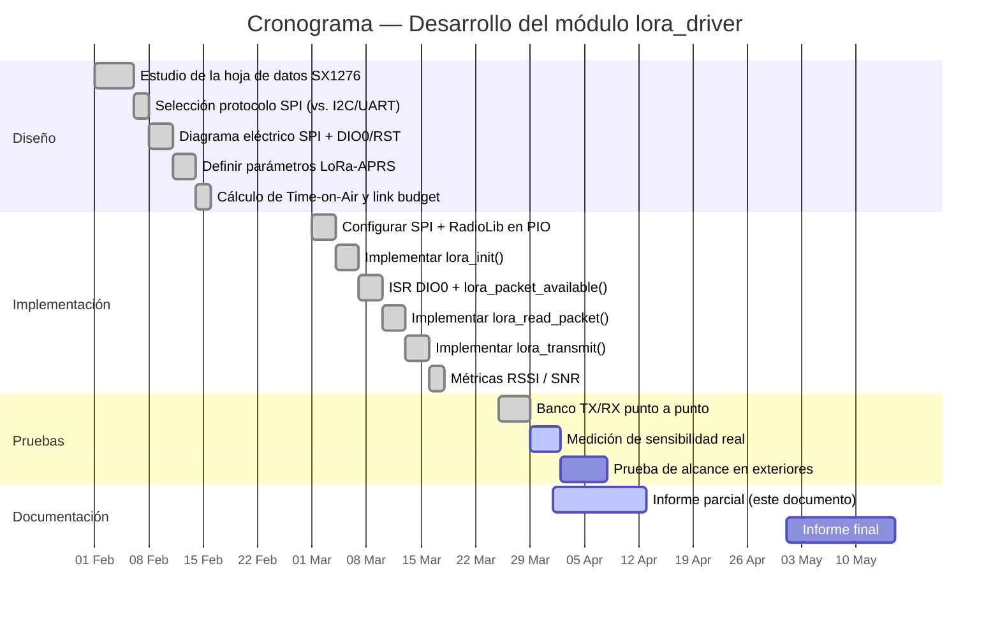

# Informe Parcial — Módulo LoRa Driver

**Proyecto:** iGate APRS LoRa (TI1TEC-10)
**Plataforma:** LILYGO T3 V1.6.1 (ESP32 + Semtech SX1276)
**Firmware:** v1.0.0 — PlatformIO + Arduino Framework
**Librería de radio:** RadioLib v6.6.0
**Fecha:** Abril 2026
**Alcance:** Este informe documenta exclusivamente el módulo `lora_driver`, responsable de la capa física de radio del iGate. Se describe el subsistema de hardware, la justificación de los protocolos y parámetros de modulación, el flujo de software y las tramas intercambiadas entre el microcontrolador ESP32 y el transceptor SX1276.

---

## 1. Introducción

El módulo `lora_driver` es la capa de abstracción de hardware (HAL) del firmware del iGate que encapsula al transceptor LoRa **Semtech SX1276**. Su responsabilidad es:

1. Inicializar el bus SPI y configurar los registros del SX1276 con los parámetros de modulación LoRa-APRS.
2. Mantener al transceptor en modo recepción continua y notificar al firmware principal cuando llega un paquete vía interrupción de hardware (DIO0).
3. Leer paquetes recibidos desde el FIFO interno del SX1276, junto con métricas de calidad de enlace (RSSI y SNR).
4. Transmitir paquetes APRS a la banda 433 MHz cuando el subsistema de beacon o de digipeater así lo requiera.

El módulo expone una API en C de seis funciones (descritas en la Sección 9) y oculta toda la complejidad del bus SPI, el manejo de interrupciones y el protocolo de registros del SX1276.

---

## 2. Diagrama Eléctrico de Conexiones

El SX1276 es un transceptor periférico que se comunica con el ESP32 mediante un bus SPI de 4 hilos más tres líneas digitales auxiliares (RST, DIO0, DIO1). En la placa LILYGO T3 V1.6.1 las conexiones están cableadas de fábrica al puerto VSPI del ESP32.

```
                     ┌──────────────────────────────┐
                     │           ESP32              │
                     │     (LILYGO T3 V1.6.1)       │
                     │                              │
   ┌── Bus VSPI ─────┤ GPIO 5    ── SCK             │
   │                 │ GPIO 19   ── MISO            │
   │                 │ GPIO 27   ── MOSI            │
   │                 │ GPIO 18   ── CS  (NSS)       │
   │                 │                              │
   │ Control digital ┤ GPIO 14   ── RST  (active L) │
   │                 │ GPIO 26   ── DIO0 (IRQ RX)   │
   │                 │ GPIO 33   ── DIO1 (aux)      │
   │                 └──────────────────────────────┘
   │
   │     ┌────────────────────────────┐
   │     │      SX1276 (LoRa)         │
   └─────┤ SCK  MISO  MOSI  NSS       │
         │ RST  ← GPIO 14             │
         │ DIO0 → GPIO 26  (RxDone)   │
         │ DIO1 → GPIO 33  (timeout)  │
         │                            │
         │  Frecuencia: 433.775 MHz   │
         │  Potencia TX: hasta +20dBm │
         │  Sensibilidad: −137 dBm    │
         └─────────────┬──────────────┘
                       │  RF_OUT / RF_IN (TRX switch interno)
                ┌──────┴──────┐
                │ Antena SMA  │
                │  433 MHz    │
                │   5 dBi     │
                └─────────────┘
```

### 2.1 Tabla detallada de pines

| # | Señal SX1276 | GPIO ESP32 | Dirección       | Tipo        | Función                                              |
|---|--------------|-----------|-----------------|-------------|------------------------------------------------------|
| 1 | SCK          | GPIO 5    | ESP32 → SX1276  | SPI clock   | Reloj síncrono del bus SPI (hasta 10 MHz)            |
| 2 | MISO         | GPIO 19   | SX1276 → ESP32  | SPI dato    | Lectura de registros y FIFO del SX1276               |
| 3 | MOSI         | GPIO 27   | ESP32 → SX1276  | SPI dato    | Escritura de registros y comandos                    |
| 4 | NSS / CS     | GPIO 18   | ESP32 → SX1276  | SPI select  | Chip Select activo en bajo                           |
| 5 | RST          | GPIO 14   | ESP32 → SX1276  | Digital     | Reset hardware del transceptor                       |
| 6 | DIO0         | GPIO 26   | SX1276 → ESP32  | Interrupción| RxDone / TxDone (configurable por registro)          |
| 7 | DIO1         | GPIO 33   | SX1276 → ESP32  | Digital     | RxTimeout / FhssChangeChannel (auxiliar)             |

### 2.2 Diagrama de bloques del subsistema LoRa

```mermaid
flowchart LR
    subgraph ESP32["ESP32 (LILYGO T3 V1.6.1)"]
        CPU["Núcleo Xtensa\nLX6 240 MHz"]
        VSPI["Controlador\nVSPI"]
        GPIO["GPIO Matrix\n(IRQ RISING)"]
    end

    subgraph SX["Semtech SX1276"]
        REG["Banco de\nregistros"]
        FIFO["FIFO 256 B\n(TX/RX compartido)"]
        MOD["Modulador /\nDemodulador LoRa"]
        PA["PA +20 dBm\nLNA"]
    end

    ANT["Antena 433 MHz\nSMA, 5 dBi"]

    CPU --> VSPI
    VSPI -- "SCK / MOSI / MISO / NSS" --> REG
    REG <--> FIFO
    FIFO <--> MOD
    MOD <--> PA
    PA <--> ANT
    GPIO <-- "DIO0 RxDone/TxDone" --- MOD
    CPU -- "RST GPIO14" --> REG
```

---

## 3. Justificación del Protocolo SPI

### 3.1 ¿Por qué SPI y no I²C o UART?

El SX1276 es un dispositivo de RF de alto rendimiento cuya **única interfaz de control disponible es SPI**; los otros protocolos comunes en sistemas embebidos quedan descartados por el propio diseño de silicio de Semtech. Aun así, se documenta a continuación la justificación técnica:

| Criterio                  | SPI (elegido)                                         | I²C                                  | UART                            |
|---------------------------|-------------------------------------------------------|--------------------------------------|---------------------------------|
| Disponibilidad en SX1276  | **Sí (única opción)**                                 | No soportado                         | No soportado                    |
| Velocidad máxima          | 10 MHz (full-duplex)                                  | 1 MHz (half-duplex)                  | ≤ 5 Mbaud                       |
| Latencia de lectura FIFO  | < 250 µs para 256 B                                   | > 2 ms para 256 B                    | Variable, sin DMA               |
| Acceso a registros        | Direccionamiento de 7 bits + R/W en un byte           | Requiere overhead de dirección esclavo | No estructurado              |
| Compatibilidad RadioLib   | Nativa                                                | No disponible                        | No disponible                   |

**Conclusiones operativas:**

- **Latencia crítica post-IRQ.** Tras una interrupción `RxDone` en DIO0, el firmware dispone de pocos milisegundos para vaciar el FIFO antes de que el SX1276 pueda volver a recibir. SPI a 8 MHz permite vaciar 256 bytes en aproximadamente 256 µs (tiempo de bit) más overhead de comandos, muy por debajo del plazo del estándar.
- **Full-duplex.** En cada transferencia se puede escribir un comando y simultáneamente leer la respuesta del registro, eliminando ciclos de turnaround.
- **Selección por hardware (NSS).** El uso de un Chip Select dedicado evita colisiones y permite compartir el bus VSPI con otros periféricos en el futuro (por ejemplo, una tarjeta SD), sin reconfigurar el transceptor.

### 3.2 Topología del bus VSPI

El ESP32 dispone de tres controladores SPI accesibles desde el firmware: HSPI, VSPI y SPI. La placa LILYGO T3 cablea el SX1276 al **VSPI** y la librería `SPI.h` del Arduino-ESP32 lo expone como instancia por defecto. Se inicializa explícitamente con los pines del LILYGO T3 para evitar la asignación por defecto del IDF:

```cpp
// Firmware/src/lora_driver.cpp
SPI.begin(LORA_SCK,   // GPIO 5
          LORA_MISO,  // GPIO 19
          LORA_MOSI,  // GPIO 27
          LORA_CS);   // GPIO 18
```

### 3.3 Cronograma temporal de una transacción SPI

```
   NSS  ────────┐_________________________________________┌────
                │                                          │
   SCK  ────────│┐_┐_┐_┐_┐_┐_┐_┐_┐_┐_┐_┐_┐_┐_┐_┐_┐_┐_┐_┐_┐_│────
                │└─┘└─┘└─┘└─┘└─┘└─┘└─┘└─┘└─┘└─┘└─┘└─┘└─┘└─┘ │
   MOSI ────────│ Addr(7..0) | Data write byte             │────
                │  W/R bit                                  │
   MISO ────────│      0     | Data read byte (FIFO)       │────
                │                                          │
                tCSS                                       tCSH
                (CS setup)                          (CS hold)
```

- **Modo SPI:** 0 (CPOL=0, CPHA=0) — reloj inactivo en bajo, muestreo en flanco de subida.
- **Bit MSB primero.**
- **Bit 7 del primer byte:** 1 = escritura, 0 = lectura. Bits 6..0 = dirección de registro (0x00–0x7F).
- **Lectura/escritura en ráfaga del FIFO:** se mantiene NSS bajo y se envían N bytes consecutivos al registro `RegFifo` (0x00).

---

## 4. Justificación de los Parámetros LoRa

LoRa es una modulación de espectro ensanchado por chirps (CSS, *Chirp Spread Spectrum*) patentada por Semtech. Sus parámetros físicos —frecuencia, ancho de banda (BW), factor de propagación (SF), tasa de codificación (CR), potencia y sync word— determinan el balance entre **alcance, robustez, throughput y consumo**. En el contexto de APRS-LoRa la red opera bajo una configuración estándar que se replica en este proyecto:

| Parámetro            | Valor configurado | Justificación técnica                                                                                                                                |
|----------------------|-------------------|------------------------------------------------------------------------------------------------------------------------------------------------------|
| Frecuencia portadora | 433.775 MHz       | Banda ISM Región 2 (Américas). Frecuencia central acordada por la comunidad APRS-LoRa para evitar colisiones con LoRaWAN (868/915 MHz) y otros usuarios. |
| Ancho de banda       | 125 kHz           | Compromiso clásico LoRa: maximiza la sensibilidad sin sacrificar demasiado throughput. Alternativas (250/500 kHz) reducen alcance.                    |
| Spreading Factor     | SF12              | Cada incremento de SF duplica el tiempo en aire pero gana ~2.5 dB de sensibilidad. SF12 es la configuración más robusta del SX1276 (−137 dBm).         |
| Coding Rate          | 4/5               | FEC mínimo (1 bit redundante por cada 4 útiles). Suficiente para canales con SNR positivo; reduce el tiempo en aire frente a 4/8.                    |
| Potencia TX          | +17 dBm (≈ 50 mW) | Máximo permitido sin amplificador externo en el camino RFO/PA_BOOST del SX1276 a 433 MHz; respeta límites ISM regionales.                            |
| Sync Word            | 0x12              | Sync word oficial de la red APRS-LoRa, distinta de LoRaWAN público (0x34). Filtra paquetes de otras redes en capa física.                            |
| Preámbulo            | 8 símbolos        | Estándar APRS-LoRa. A SF12/BW125 equivale a ≈ 262 ms; permite al receptor sincronizarse antes del header.                                            |
| CRC LoRa             | Deshabilitado     | El estándar APRS-LoRa transmite la verificación de integridad en la capa AX.25/APRS, no en LoRa. `radio.setCRC(false)` evita descartes erróneos.     |

### 4.1 Cálculo del *Time-on-Air* (ToA)

El tiempo en aire de un paquete LoRa se calcula con la fórmula de Semtech (Application Note AN1200.13):

$$T_{sym} = \frac{2^{SF}}{BW}$$

$$T_{preamble} = (n_{preamble} + 4.25) \cdot T_{sym}$$

$$N_{payload} = 8 + \max\!\left(\left\lceil\frac{8 \cdot PL - 4 \cdot SF + 28 + 16 \cdot CRC - 20 \cdot H}{4 \cdot (SF - 2 \cdot DE)}\right\rceil \cdot (CR + 4),\ 0\right)$$

$$T_{packet} = T_{preamble} + N_{payload} \cdot T_{sym}$$

Para los parámetros configurados (SF=12, BW=125 kHz, CR=4/5, $n_{preamble}$=8, CRC=0, header explícito):

| Tamaño de payload | $T_{sym}$ | $T_{preamble}$ | $T_{payload}$ | **Tiempo en aire total** |
|-------------------|-----------|-----------------|---------------|---------------------------|
| 25 B (beacon corto)| 32.77 ms  | 401 ms          | 0.69 s        | **≈ 1.09 s**              |
| 50 B (posición + comentario)| 32.77 ms | 401 ms | 1.18 s        | **≈ 1.58 s**              |
| 100 B (mensaje largo)| 32.77 ms| 401 ms          | 2.16 s        | **≈ 2.56 s**              |
| 220 B (máximo APRS)| 32.77 ms  | 401 ms          | 4.62 s        | **≈ 5.02 s**              |

**Tasa de datos efectiva:** $R_b = SF \cdot \frac{BW}{2^{SF}} \cdot \frac{4}{4+CR} \approx 293\ \text{bps}$.

> Estos cálculos justifican la elección de SF12: aunque la latencia es alta (segundos por paquete), APRS es un protocolo de baja tasa (1 beacon cada 5–10 minutos) y se prioriza el alcance.

### 4.2 Presupuesto de enlace (Link Budget)

Asumiendo:

- $P_{TX}$ = +17 dBm
- $G_{TX}$ = $G_{RX}$ = +5 dBi (antena SMA típica)
- $L_{cable}$ = 1 dB por extremo
- Sensibilidad receptor a SF12/BW125 = −137 dBm (datasheet SX1276)

$$\text{Pérdida máxima permitida} = P_{TX} + G_{TX} + G_{RX} - L_{cable,\,TX} - L_{cable,\,RX} - S_{RX}$$

$$L_{max} = 17 + 5 + 5 - 1 - 1 - (-137) = 162\ \text{dB}$$

Aplicando el modelo de espacio libre (Friis) a 433 MHz:

$$L_{FS}(d) = 32.45 + 20 \log_{10}(f_{MHz}) + 20 \log_{10}(d_{km})$$

Despejando $d$ con $L_{FS} = 162$ dB y $f$ = 433.775 MHz se obtiene un alcance teórico LOS de **≈ 250 km**. En la práctica, con obstrucciones urbanas y márgenes de fading (~30 dB), el alcance esperable es de **5–20 km en zona urbana** y **30–80 km con línea de vista despejada**, lo cual es coherente con resultados publicados por la comunidad APRS-LoRa.

---

## 5. Arquitectura de Software del Módulo

### 5.1 Diagrama de capas



El driver actúa como **fachada (Facade)**: oculta los detalles de RadioLib y expone una API mínima orientada a casos de uso APRS (recibir/transmitir paquetes binarios). Esto permite, en un futuro, sustituir RadioLib por otra librería (por ejemplo, *arduino-LoRa* o un driver propio sobre el IDF) sin modificar `beacon`, `aprs_parser` ni `main`.

### 5.2 Máquina de estados interna del SX1276

Aunque RadioLib expone primitivas de alto nivel, internamente el SX1276 transita entre los modos definidos por el registro `RegOpMode` (0x01). El driver controla estas transiciones implícitamente:



| Modo      | Consumo aprox. | Uso en el iGate                                               |
|-----------|----------------|---------------------------------------------------------------|
| SLEEP     | < 1 µA         | No se usa (el iGate está siempre alimentado por USB).         |
| STANDBY   | ~ 1.5 mA       | Estado intermedio entre RX y TX.                              |
| RXCONT    | ~ 12 mA        | Modo principal del iGate: escucha continua del canal.         |
| TX (+17 dBm)| ~ 90 mA      | Sólo durante transmisión de beacons o reenvíos digipeater.    |

### 5.3 Flujo de inicialización (`lora_init`)



### 5.4 Ciclo recepción → lectura → re-armado



### 5.5 Manejo de la interrupción DIO0

La línea DIO0 del SX1276 está configurada por defecto en modo LoRa para señalizar **RxDone** mientras el chip está en RX continuo y **TxDone** mientras está transmitiendo. El driver registra una rutina de servicio mínima:

```cpp
// Firmware/src/lora_driver.cpp
volatile bool flag_paquete = false;

IRAM_ATTR void lora_isr() {
    flag_paquete = true;
}
```

**Reglas observadas:**

1. La función vive en IRAM (`IRAM_ATTR`) para evitar fallos cuando la flash está siendo accedida (por ejemplo, durante OTA o lecturas SPIFFS).
2. Solo escribe una variable `volatile bool` — no realiza accesos SPI ni `Serial.print`, ya que ambos están prohibidos en contexto de interrupción del ESP32.
3. El procesamiento real (`radio.readData`) ocurre en el bucle principal cuando la aplicación consulta `lora_packet_available()`. Esto desacopla la latencia de la ISR de la latencia de la aplicación.

---

## 6. Pseudocódigo del Módulo

```
MÓDULO lora_driver

VARIABLES INTERNAS:
    radio          : SX1276(CS=18, DIO0=26, RST=14, DIO1=33)
    flag_paquete   : booleano volátil = falso
    buffer_rx[256] : arreglo de bytes
    longitud_rx    : entero = 0
    último_rssi    : entero  = 0
    último_snr     : flotante = 0.0

────────────────────────────────────────────

ISR lora_isr()                      // contexto de interrupción
    flag_paquete ← verdadero        // única operación permitida
FIN ISR

────────────────────────────────────────────

FUNCIÓN lora_init() → booleano
    SPI.begin(SCK=5, MISO=19, MOSI=27, CS=18)
    resultado ← radio.begin(
        frecuencia  = 433.775 MHz,
        ancho_banda = 125 kHz,
        spreading   = SF12,
        coding_rate = 4/5,
        sync_word   = 0x12,
        potencia    = 17 dBm,
        preámbulo   = 8 símbolos
    )
    SI resultado ≠ OK: imprimir error; RETORNAR falso
    radio.setCRC(falso)                       // requerido por LoRa-APRS
    radio.setDio0Action(lora_isr, RISING)     // habilitar IRQ RxDone
    RETORNAR verdadero
FIN FUNCIÓN

────────────────────────────────────────────

FUNCIÓN lora_receive_mode()
    flag_paquete ← falso
    radio.startReceive()                      // RegOpMode ← RXCONT
FIN FUNCIÓN

FUNCIÓN lora_packet_available() → booleano
    RETORNAR flag_paquete
FIN FUNCIÓN

────────────────────────────────────────────

FUNCIÓN lora_read_packet(buffer, max_len) → bytes_leídos
    SI flag_paquete es falso: RETORNAR 0
    flag_paquete ← falso
    resultado ← radio.readData(buffer_rx, 256)   // SPI burst read FIFO
    SI resultado ≠ OK:
        imprimir error; lora_receive_mode(); RETORNAR 0
    FIN SI
    último_rssi ← radio.getRSSI()
    último_snr  ← radio.getSNR()
    longitud_rx ← radio.getPacketLength()
    copiar min(longitud_rx, max_len) bytes a buffer
    imprimir "Paquete N B | RSSI: X dBm | SNR: Y dB"
    lora_receive_mode()                          // re-armar RX
    RETORNAR bytes copiados
FIN FUNCIÓN

────────────────────────────────────────────

FUNCIÓN lora_transmit(buffer, longitud) → booleano
    imprimir "TX N bytes..."
    radio.standby()                              // detiene RX
    resultado ← radio.transmit(buffer, longitud) // bloquea hasta TxDone
    SI resultado ≠ OK:
        imprimir error; lora_receive_mode(); RETORNAR falso
    FIN SI
    imprimir "TX OK"
    lora_receive_mode()                          // vuelve a escuchar
    RETORNAR verdadero
FIN FUNCIÓN

────────────────────────────────────────────

FUNCIÓN lora_get_rssi() → entero      RETORNAR último_rssi
FUNCIÓN lora_get_snr()  → flotante    RETORNAR último_snr
```

---

## 7. Tramas de Datos

### 7.1 Estructura física de la trama LoRa

```
┌────────────┬────────┬─────────────────┬─────────────┬──────────────────────────┬─────────┐
│ Preámbulo  │ Sync   │ PHDR + PHDR_CRC │  Header CRC │       Payload            │ CRC opc.│
│ 8 símbolos │ 0x12   │ (modo explicit) │             │  hasta 256 B (FIFO)      │ (off)   │
└────────────┴────────┴─────────────────┴─────────────┴──────────────────────────┴─────────┘
   ≈ 262 ms      4 sym       Variable                       N · T_sym
```

| Campo            | Función                                                                                  |
|------------------|------------------------------------------------------------------------------------------|
| Preámbulo        | Secuencia de chirps ascendentes. Permite la sincronización de fase y frecuencia.         |
| Sync Word (0x12) | Codificada en los últimos 2.25 chirps del preámbulo. Filtra paquetes de otras redes.     |
| PHDR             | Cabecera explícita: longitud, CR, presencia de CRC. Codificada con CR 4/8 (más robusto). |
| Header CRC       | Verificación de integridad de la cabecera (8 bits).                                      |
| Payload          | Bytes binarios de aplicación (en este iGate: trama APRS en formato AX.25 textual).       |
| CRC opcional     | Deshabilitado por requerimiento del estándar LoRa-APRS.                                  |

### 7.2 Diagrama temporal de un paquete completo (SF12, BW125, payload 50 B)

```
Tiempo [ms]: 0        262   294    ...                                   1580
              │         │     │                                            │
              │ Preámb. │ PHDR│           Payload (1.18 s)                 │
              │ 8 sym   │+CRC │                                            │
              ▼         ▼     ▼                                            ▼
              ████████████████████████████████████████████████████████████
              ↑                                                            ↑
              startReceive() o transmit()                              DIO0 RxDone/TxDone
```

### 7.3 Trama SPI: lectura del FIFO tras RxDone

```
ESP32                                                        SX1276
  │                                                              │
  │ NSS ↓                                                        │
  │── 0x0D (RegFifoRxCurrentAddr | R) ─────────────────────────► │
  │ ◄────────────── current_addr (ej. 0x00) ────────────────── ──│
  │ NSS ↑                                                        │
  │                                                              │
  │ NSS ↓                                                        │
  │── 0x0D (RegFifoAddrPtr | W) ──────────────────────────────►  │
  │── current_addr ───────────────────────────────────────────►  │
  │ NSS ↑                                                        │
  │                                                              │
  │ NSS ↓                                                        │
  │── 0x00 (RegFifo | R, burst) ─────────────────────────────► │
  │ ◄────── byte[0] byte[1] byte[2] … byte[N-1] ────────────── ──│
  │ NSS ↑                                                        │
  │                                                              │
  │ NSS ↓                                                        │
  │── 0x1A (RegPktRssiValue | R) ─────────────────────────────►  │
  │ ◄────────────── rssi_raw ──────────────────────────────────  │
  │ NSS ↑                                                        │
  │                                                              │
  │ NSS ↓                                                        │
  │── 0x19 (RegPktSnrValue | R) ──────────────────────────────►  │
  │ ◄────────────── snr_raw ───────────────────────────────────  │
  │ NSS ↑                                                        │
  ▼                                                              ▼
  Total: ~ 250 µs para N=256                       Vuelve a RXCONT
```

### 7.4 Trama SPI: escritura del FIFO para transmisión

```
ESP32                                                        SX1276
  │                                                              │
  │── RegOpMode ← STANDBY  ────────────────────────────────►     │
  │── RegFifoTxBaseAddr ← 0x00 ───────────────────────────►      │
  │── RegFifoAddrPtr ← 0x00 ──────────────────────────────►      │
  │                                                              │
  │ NSS ↓                                                        │
  │── 0x80 (RegFifo | W, burst) ─────────────────────────────►   │
  │── byte[0] byte[1] byte[2] … byte[N-1] ───────────────────►   │
  │ NSS ↑                                                        │
  │                                                              │
  │── RegPayloadLength ← N ───────────────────────────────►      │
  │── RegOpMode ← TX ─────────────────────────────────────►      │
  │                                                              │
  │  (espera DIO0 TxDone; bloqueante en RadioLib)                │
  │ ◄─── DIO0 RISING (TxDone) ──────────────────────────────────│
  │── RegOpMode ← RXCONT (re-armado RX) ───────────────────►     │
  ▼                                                              ▼
```

### 7.5 Encapsulamiento de un paquete APRS dentro del payload LoRa

Dentro del payload binario de LoRa, el iGate transporta una trama APRS textual con prefijo de 3 bytes definida por el estándar **OE5BPA / APRS-LoRa**:

```
┌──────┬──────┬──────┬──────────────────────────────────────────────┐
│ 0x3C │ 0xFF │ 0x01 │   Trama APRS en formato AX.25 textual        │
└──────┴──────┴──────┴──────────────────────────────────────────────┘
   '<'   0xFF   ver   ej: "TI1TEC-10>APLT00,WIDE1-1:!1023.45N/08434.21W&iGate"
```

Esta encapsulación es transparente para `lora_driver` (que sólo ve un buffer binario) y la procesa el módulo `aprs_parser` en una capa superior.

---

## 8. Cronograma del Proyecto (módulo LoRa)



---

## 9. Presupuesto del Subsistema LoRa

### 9.1 Hardware

| Componente                                   | Cantidad | Precio Unitario (USD) | Subtotal (USD) |
|----------------------------------------------|----------|------------------------|-----------------|
| LILYGO T3 V1.6.1 (ESP32 + SX1276 integrado) | 1        | $22.00                 | $22.00          |
| Antena 433 MHz SMA, 5 dBi                    | 1        | $5.00                  | $5.00           |
| Cable USB-C (alimentación + programación)    | 1        | $3.00                  | $3.00           |
| Fuente 5 V / 1 A USB                         | 1        | $4.00                  | $4.00           |
| **Subtotal iGate**                           |          |                        | **$34.00**      |

### 9.2 Nodo remoto para pruebas LoRa punto a punto

| Componente                              | Cantidad | Precio Unitario (USD) | Subtotal (USD) |
|------------------------------------------|----------|------------------------|-----------------|
| LILYGO T3 V1.6.1 (nodo de pruebas)      | 1        | $22.00                 | $22.00          |
| Antena 433 MHz SMA                       | 1        | $5.00                  | $5.00           |
| **Subtotal Nodo**                        |          |                        | **$27.00**      |

### 9.3 Software

| Recurso                          | Costo  | Uso en el módulo                              |
|----------------------------------|--------|-----------------------------------------------|
| PlatformIO + Arduino-ESP32       | Gratis | Compilación y carga                           |
| RadioLib v6.6.0 (MIT)            | Gratis | Driver SX1276 invocado por `lora_driver`      |
| Arduino SPI (esp32-hal-spi)      | Gratis | Bus SPI hacia el SX1276                       |

### 9.4 Resumen

| Categoría             | Total (USD) |
|-----------------------|-------------|
| Hardware iGate         | $34.00      |
| Nodo de pruebas        | $27.00      |
| Software               | $0.00       |
| **TOTAL**              | **$61.00**  |

---

## 10. Parámetros de Configuración

Definidos en [config.h](../Firmware/src/config.h):

| Parámetro       | Valor      | Descripción                                       |
|-----------------|------------|---------------------------------------------------|
| `LORA_FREQ`     | 433.775 MHz| Frecuencia portadora (APRS-LoRa Región 2)         |
| `LORA_BW`       | 125 kHz    | Ancho de banda                                    |
| `LORA_SF`       | 12         | Spreading Factor                                  |
| `LORA_CR`       | 5          | Coding Rate 4/5                                   |
| `LORA_SYNC`     | 0x12       | Sync Word LoRa-APRS                               |
| `LORA_POWER`    | 17 dBm     | Potencia TX (~50 mW)                              |
| `LORA_PREAMBLE` | 8          | Símbolos de preámbulo                             |
| `LORA_SCK`      | GPIO 5     | SPI Clock                                         |
| `LORA_MISO`     | GPIO 19    | SPI Master-In Slave-Out                           |
| `LORA_MOSI`     | GPIO 27    | SPI Master-Out Slave-In                           |
| `LORA_CS`       | GPIO 18    | SPI Chip Select (NSS)                             |
| `LORA_RST`      | GPIO 14    | Reset hardware del SX1276                         |
| `LORA_DIO0`     | GPIO 26    | Interrupción RxDone / TxDone                      |
| `LORA_DIO1`     | GPIO 33    | Línea auxiliar (RxTimeout)                        |

---

## 11. API Pública del Módulo

Declarada en [lora_driver.h](../Firmware/src/lora_driver.h):

| Función                              | Retorno    | Descripción                                                  |
|--------------------------------------|------------|--------------------------------------------------------------|
| `lora_init()`                        | `bool`     | Inicializa SPI + SX1276 con parámetros LoRa-APRS.            |
| `lora_receive_mode()`                | `void`     | Coloca al SX1276 en recepción continua (RXCONT).             |
| `lora_packet_available()`            | `bool`     | `true` si la ISR de DIO0 detectó un RxDone pendiente.        |
| `lora_read_packet(buf, max_len)`     | `uint8_t`  | Lee el paquete del FIFO; devuelve el número de bytes leídos. |
| `lora_transmit(buf, len)`            | `bool`     | Transmite `len` bytes; bloquea hasta TxDone.                 |
| `lora_get_rssi()`                    | `int16_t`  | RSSI del último paquete recibido (dBm).                      |
| `lora_get_snr()`                     | `float`    | SNR del último paquete recibido (dB).                        |

---

## 12. Conclusiones del módulo

- **SPI es el único protocolo viable** para el SX1276 y, además, ofrece la latencia y throughput necesarios para vaciar el FIFO antes del siguiente paquete.
- **Los parámetros LoRa elegidos (SF12, BW125, CR4/5, +17 dBm, sync 0x12)** son los estandarizados por la comunidad APRS-LoRa Región 2 y, según el cálculo de link budget, habilitan alcances de decenas de kilómetros con antenas modestas.
- **La arquitectura ISR + flag + lectura diferida** mantiene la rutina de interrupción mínima y delega el trabajo pesado al bucle principal, evitando bloqueos del watchdog del ESP32.
- **El driver expone seis funciones** suficientes para implementar las funcionalidades de iGate (sólo RX → IS) y, opcionalmente, beacon/digipeater (RX + TX), sin acoplarse a la librería RadioLib desde las capas superiores.