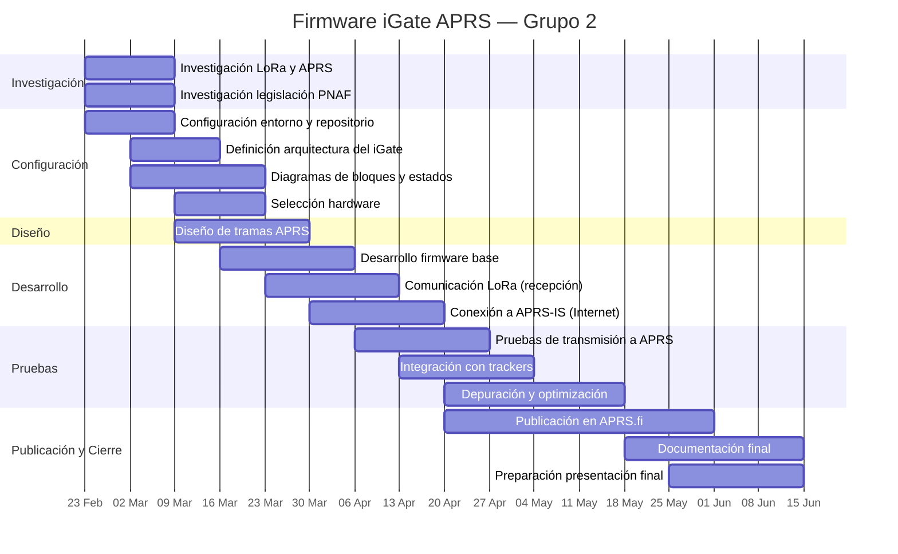

# Taller_Integrador
El presente respositorio corresponde al trabajo realizado por el grupo 2, conformado por Alvaro Chacón y Denzel Lynch, en el curso EL5610 Taller Integrador de la carrera de Ingeniería en Electrónica del Instituto Tecnológico de Costa Rica.

En el siguiente enlace podrá observar generalidades del protocolo APRS y LORA:

https://www.canva.com/design/DAHCYHS7kGw/CJDRDF5Uz_gmbKo0bwzgLw/edit?utm_content=DAHCYHS7kGw&utm_campaign=designshare&utm_medium=link2&utm_source=sharebutton

## 📅 Cronograma del Proyecto — Firmware iGate APRS (Grupo 2)

