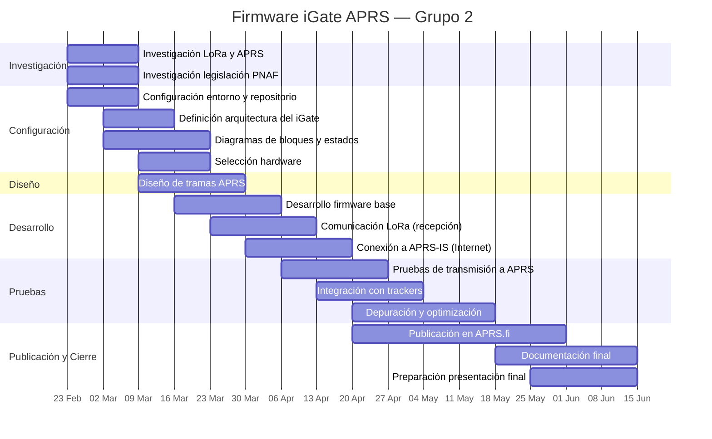

# Firmware para módulo iGate protocolos LORA/APRS
El presente respositorio corresponde al trabajo realizado por el grupo 2, conformado por Alvaro Chacón y Denzel Lynch, en el curso EL5610 Taller Integrador de la carrera de Ingeniería en Electrónica del Instituto Tecnológico de Costa Rica.

## Tabla de contenidos

- [Descripción del proyecto](#descripción-del-proyecto)
- [Cronograma del Proyecto ](#cronograma-del-proyecto--firmware-igate-aprs-grupo-2)
- [Documentación de funcionamiento y legislación de protocolos LORA y APRS](#documentación-de-funcionamiento-y-lesgislación-de-protocolos-lora-y-aprs)
- [Máquina de Estados ](#máquina-de-estados--igate-aprs-esp32-lilygo)
  - [Diagrama de transiciones](#diagrama-de-transiciones)
  - [Descripción de cada estado](#descripción-de-cada-estado)
    - [S0: Boot](#s0-boot)
    - [S1: WiFi Connect](#s1-wifi-connect)
    - [Sin WiFi (modo offline)](#sin-wifi-modo-offline)
    - [S2: APRS-IS Connect](#s2-aprs-is-connect)
    - [S3: Idle / Escucha LoRa](#s3-idle--escucha-lora)
    - [S4: Decodificar APRS](#s4-decodificar-aprs)
    - [S5: Forward APRS-IS](#s5-forward-aprs-is)
    - [S6: Beacon TX](#s6-beacon-tx)
    - [S7: Error / Watchdog](#s7-error--watchdog)
  - [Resumen de estados](#resumen-de-estados)
- [Diagrama de bloques ](#diagrama-de-bloques--igate-aprs-esp32-lilygo)
  - [Diagrama](#diagrama)
  - [Descripción general](#descripción-general)
  - [Capa 1: Hardware — LILYGO ESP32](#capa-1-hardware--lilygo-esp32)
  - [Capa 2: Firmware — ESP32](#capa-2-firmware--esp32)
    - [FSM controller](#fsm-controller)
    - [LoRa driver](#lora-driver)
    - [APRS parser](#aprs-parser)
    - [APRS-IS client](#aprs-is-client)
    - [Beacon builder](#beacon-builder)
    - [Display manager](#display-manager)
    - [Config manager](#config-manager)
    - [WDT (Watchdog timer)](#wdt-watchdog-timer)
  - [Capa 3: Internet — Red APRS-IS](#capa-3-internet--red-aprs-is)
  - [Flujo de datos principal](#flujo-de-datos-principal)
  - [Flujo del beacon](#flujo-del-beacon)

## Descripción del proyecto

Este repositorio alberga el Firmware desarrollado para el funcionamiento de un módulo iGate, el hardware específico es el TTGO Lilygo LoRa32 T3S3 V1.2. Este recibirá los paquetes de posición GPS provenientes de "Trackers" asigandos a otros grupos, trabajando en una banda de frecuencia de 433.775 MHz siguiendo la legislación costarricense (PNAF, Decreto N° 44010-MICITT), y esta información será tomada por un servidor, el cual permitirá el monitoreo de los trackers en una plataforma como [aprs.fi](https://aprs.fi)

El firmware de referencia fue desarrollado por Ricardo Guzman (richonguzman) y se encuentra en GitHub como [LoRa_APRS_iGate](https://github.com/richonguzman/LoRa_APRS_iGate?tab=readme-ov-file)

## Cronograma del Proyecto — Firmware iGate APRS (Grupo 2)


## Documentación de funcionamiento y lesgislación de protocolos LORA y APRS

En el siguiente enlace podrá observar generalidades del protocolo APRS y LORA:

https://www.canva.com/design/DAHCYHS7kGw/CJDRDF5Uz_gmbKo0bwzgLw/edit?utm_content=DAHCYHS7kGw&utm_campaign=designshare&utm_medium=link2&utm_source=sharebutton


## Máquina de Estados — iGate APRS ESP32 LILYGO

### Diagrama de transiciones

| Estado actual | Evento / Condición | Estado siguiente |
|---|---|---|
| S0: Boot | Siempre | S1: WiFi Connect |
| S1: WiFi Connect | Conexión exitosa | S2: APRS-IS Connect |
| S1: WiFi Connect | Timeout / fallo | Sin WiFi (modo offline) |
| Sin WiFi | WiFi disponible (retry) | S1: WiFi Connect |
| S2: APRS-IS Connect | Login OK | S3: Idle / Escucha |
| S2: APRS-IS Connect | Error TCP | S7: Error / Watchdog |
| S3: Idle / Escucha | Paquete LoRa recibido | S4: Decodificar APRS |
| S3: Idle / Escucha | Timer beacon vencido | S6: Beacon TX |
| S3: Idle / Escucha | Conexión TCP caída | S2: APRS-IS Connect |
| S4: Decodificar APRS | Frame válido | S5: Forward APRS-IS |
| S4: Decodificar APRS | Frame inválido | S3: Idle / Escucha (descarta) |
| S5: Forward APRS-IS | Enviado correctamente | S3: Idle / Escucha |
| S5: Forward APRS-IS | Error TCP | S7: Error / Watchdog |
| S6: Beacon TX | TX completado | S3: Idle / Escucha |
| S6: Beacon TX | Error LoRa | S7: Error / Watchdog |
| S7: Error / Watchdog | Fallo recuperable | S1: WiFi Connect |
| S7: Error / Watchdog | Fallo crítico | S0: Boot (ESP.restart()) |

---

### Descripción de cada estado


### S0: Boot
**Color:** Gris (arranque)

Primer estado al encender o reiniciar el ESP32. Inicializa todos los periféricos de hardware
No tiene condición de salida: siempre avanza a S1 al terminar la inicialización. Si algún periférico falla (por ejemplo el LoRa no responde en SPI), se puede redirigir directamente a S7.

---

### S1: WiFi Connect
**Color:** Azul (conexión de red)

Intenta conectarse al punto de acceso WiFi configurado usando las credenciales almacenadas (SSID + password en `config.h` o EEPROM). Muestra en el OLED el estado de conexión y la dirección IP asignada al conectarse.

- Si la conexión es exitosa → avanza a S2.
- Si vence el timeout (típicamente 20–30 segundos) → entra al modo Sin WiFi para operar de forma limitada.

---

### Sin WiFi (modo offline)
**Color:** Ámbar (advertencia)

Estado de contingencia cuando no hay red disponible. El iGate sigue funcionando parcialmente:
- El receptor LoRa permanece activo y puede escuchar paquetes.
- Los paquetes recibidos se muestran en el OLED pero no se suben a APRS-IS.
- Se intenta reconectar al WiFi periódicamente.

Cuando el WiFi vuelve a estar disponible, retorna a S1 para restablecer la conexión completa.

---

### S2: APRS-IS Connect
**Color:** Azul (conexión de red)

Establece la conexión TCP con el servidor de la red APRS-IS. El flujo es:
1. Resolver DNS de `rotate.aprs2.net` (o servidor regional).
2. Abrir socket TCP en el puerto 14580.
3. Enviar el string de login: `user CALLSIGN pass PASSCODE vers firmware_version`.
4. Verificar la respuesta del servidor (`# logresp ... verified`).

Si el login es verificado → avanza a S3. Si falla (servidor no responde, credenciales incorrectas, error TCP) → va a S7.

---

### S3: Idle / Escucha LoRa
**Color:** Teal (espera activa)

Estado central donde el iGate pasa la mayor parte del tiempo. El módulo LoRa está en modo recepción continua (`receiveMode()`). En cada ciclo del loop se verifican tres condiciones en paralelo:

1. **¿Llegó un paquete LoRa?** → S4
2. **¿Venció el timer del beacon?** → S6
3. **¿Se cayó la conexión TCP?** → S2 para reconectar

También actualiza el OLED periódicamente con la hora, cantidad de paquetes recibidos y estado de la conexión.

---

### S4: Decodificar APRS
**Color:** Púrpura (proceso APRS)

Recibe el buffer de bytes del módulo LoRa y lo procesa para extraer el frame APRS. Las tareas son:
- Verificar el preámbulo y el CRC del paquete LoRa.
- Decodificar el protocolo AX.25 (dirección origen, destino, path de digipeaters).
- Parsear el payload APRS: tipo de paquete (posición, telemetría, mensaje, objeto).
- Mostrar en el OLED: callsign, RSSI y SNR de la señal recibida.

Si el frame es válido y bien formado → S5. Si está corrupto o no es APRS válido → descarta y vuelve a S3 sin subir nada.

---

### S5: Forward APRS-IS
**Color:** Púrpura (proceso APRS)

Toma el frame APRS ya decodificado y lo reenvía al servidor APRS-IS a través de la conexión TCP establecida en S2. El paquete se envía con el formato estándar de iGate:

```
CALLSIGN>APRS,TCPIP*,qAR,IGATE-CALLSIGN:frame_original
```

Después del envío actualiza el contador de paquetes forwarded en el OLED. Si el TCP falla durante el envío → S7. Si el envío es exitoso → regresa a S3 a seguir escuchando.

---

### S6: Beacon TX
**Color:** Coral (transmisión)

Transmite la posición GPS del iGate como un paquete APRS por LoRa, para que otros equipos en el aire (globos, trackers) puedan ver la ubicación de la estación. El flujo es:
1. Leer coordenadas fijas desde la configuración (config.h).
2. Construir el frame APRS de posición con símbolo de iGate (`/&`).
3. Cambiar el módulo LoRa a modo transmisión (`transmit()`).
4. Enviar el paquete y esperar confirmación de TX completo.
5. Volver al modo recepción y regresar a S3.

El timer del beacon se reinicia al completar la transmisión.

---

### S7: Error / Watchdog
**Color:** Rojo (error)

Estado de manejo de fallos. Se activa ante cualquier error crítico: fallo de hardware, timeout de red, excepción no manejada, o el watchdog timer del ESP32 por un loop bloqueado.

Dependiendo de la gravedad:
- **Fallo recuperable** (WiFi caído, servidor APRS-IS no responde): espera unos segundos y regresa a S1 para reintentar la conexión desde cero.
- **Fallo crítico** (LoRa no inicializa, corrupción de memoria, watchdog timeout): ejecuta `ESP.restart()` para reiniciar el microcontrolador completo, volviendo a S0.

---

### Resumen de estados

| ID | Nombre | Color | Función principal |
|---|---|---|---|
| S0 | Boot | Gris | Inicializar hardware |
| S1 | WiFi Connect | Azul | Conectar a la red local |
| — | Sin WiFi | Ámbar | Operación degradada sin red |
| S2 | APRS-IS Connect | Azul | Autenticarse en la red APRS |
| S3 | Idle / Escucha | Teal | Recibir paquetes LoRa |
| S4 | Decodificar APRS | Púrpura | Parsear y validar el frame |
| S5 | Forward APRS-IS | Púrpura | Subir el paquete a internet |
| S6 | Beacon TX | Coral | Transmitir posición GPS |
| S7 | Error / Watchdog | Rojo | Manejar fallos y reiniciar |

## Diagrama de bloques — iGate APRS ESP32 LILYGO
 
### Diagrama
 

 
---
 
### Descripción general
 
El sistema se divide en tres capas: hardware físico, firmware y red internet. Los datos fluyen desde la antena LoRa hacia arriba hasta llegar a la red APRS-IS y finalmente a aprs.fi.
 
---
 
### Capa 1: Hardware — LILYGO ESP32
 
Componentes físicos presentes en la placa.
 
| Módulo | Interfaz | Función |
|---|---|---|
| LoRa SX1278 | SPI | Recepción y transmisión de paquetes APRS en 433 MHz |
| WiFi ESP32 | Integrado | Conexión a red local y a internet |
| OLED display | I2C | Visualización de estado, RSSI y paquetes recibidos |
 
> El iGate no cuenta con módulo GPS. La posición se configura como coordenadas fijas en `config.h`.
 
---
 
### Capa 2: Firmware — ESP32
 
#### FSM controller
Módulo central del firmware. Ejecuta la máquina de estados (S0–S7) en el loop principal y coordina todos los demás módulos. Ningún módulo actúa por cuenta propia — todos reciben órdenes del FSM o le reportan eventos.
 
#### LoRa driver
Abstrae la comunicación SPI con el módulo LoRa SX1278 usando la librería RadioLib. Expone dos operaciones principales al FSM: modo recepción continua (`receiveMode()`) y transmisión de un buffer (`transmit()`). Reporta al FSM cuando llega un paquete nuevo.
 
#### APRS parser
Recibe el buffer de bytes del LoRa driver y lo decodifica. Verifica el preámbulo AX.25, valida el CRC, extrae el callsign origen, destino, path de digipeaters y el payload APRS. Retorna un frame estructurado al FSM, o un error si el paquete es inválido.
 
#### APRS-IS client
Maneja la conexión TCP con el servidor `rotate.aprs2.net` en el puerto 14580. Realiza el login con callsign y passcode, mantiene la conexión activa, y expone una función `forward(frame)` que el FSM llama al recibir un paquete válido. Detecta caídas de conexión y notifica al FSM para reconectar.
 
#### Beacon builder
Construye el frame APRS de posición que el iGate transmite periódicamente por LoRa. Lee las coordenadas fijas almacenadas en el Config manager, las formatea en el estándar APRS con el símbolo de iGate (`/&`), y entrega el buffer listo para transmitir al LoRa driver.
 
#### Display manager
Controla el OLED de 128x64 píxeles vía I2C. Muestra en pantalla: estado de conexión WiFi y APRS-IS, callsign de la última estación escuchada, RSSI y SNR del último paquete, contador de paquetes recibidos y forwarded.
 
#### Config manager
Lee y escribe la configuración persistente en la EEPROM / Preferences del ESP32. Almacena: callsign, passcode, credenciales WiFi, coordenadas fijas de posición (latitud y longitud), intervalo del beacon, y versión del firmware. Es la fuente de verdad para el Beacon builder y el APRS-IS client.
 
#### WDT (Watchdog timer)
Temporizador de hardware del ESP32. Si el loop principal se bloquea y no ejecuta `esp_task_wdt_reset()` dentro del tiempo configurado (típicamente 10 segundos), el WDT reinicia el microcontrolador automáticamente, volviendo al estado S0.
 
---
 
### Capa 3: Internet — red APRS-IS
 
| Servicio | Función |
|---|---|
| `rotate.aprs2.net:14580` | Servidor de entrada a la red APRS-IS. Recibe los paquetes forwarded por el iGate vía TCP |
| `aprs.fi` | Visualización pública en mapa de todos los paquetes distribuidos por la red APRS-IS |
 
---
 
### Flujo de datos principal
 
```
Antena LoRa
    │  señal RF 433 MHz
    ▼
LoRa SX1278 (hardware)
    │  buffer de bytes por SPI
    ▼
LoRa driver (firmware)
    │  paquete crudo
    ▼
APRS parser (firmware)
    │  frame APRS estructurado
    ▼
FSM controller (firmware)
    │  frame validado
    ▼
APRS-IS client (firmware)
    │  TCP / internet
    ▼
rotate.aprs2.net
    │  red APRS-IS
    ▼
aprs.fi
```
 
---
 
### Flujo del beacon
 
```
FSM controller (timer vencido)
    │
    ▼
Config manager → coordenadas fijas
    │
    ▼
Beacon builder → frame APRS de posición
    │
    ▼
LoRa driver → transmit()
    │  señal RF 433 MHz
    ▼
Antena LoRa
```
